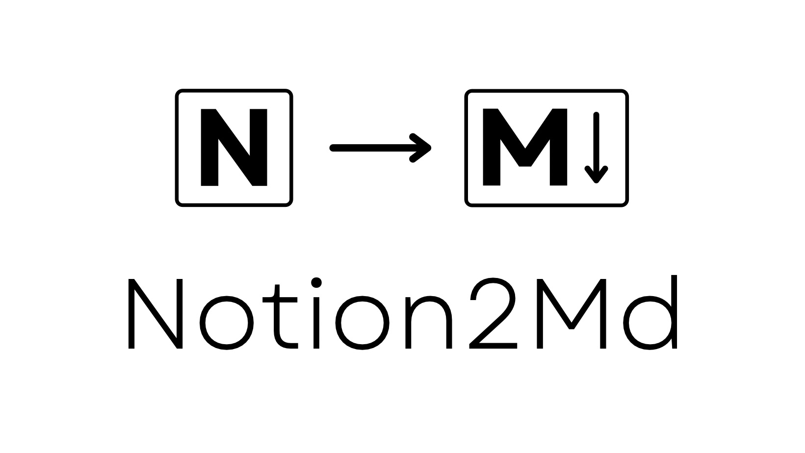
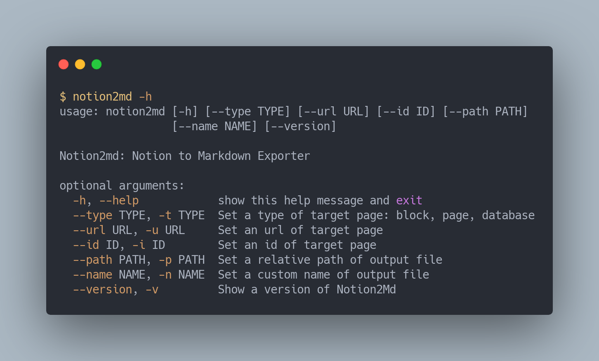

<br/>

<div align="center">
    <h1>Notion2Md</h1>
    <i>Notion Markdown Exporter with Python Cli</i>
</div>

<br/>
<br/>

## About Notion2Md

[](https://badge.fury.io/py/notion2md)

- Notion Markdown Exporter using **official notion api** by [notion-sdk-py](https://github.com/ramnes/notion-sdk-py)

## API Key(Token)

- Before getting started, create [an integration and find the token](https://www.notion.so/my-integrations). → [Learn more about authorization](https://developers.notion.com/docs/authorization).

- Then save your api key(token) as your os environment variable

```Bash
$ export NOTION_TOKEN="{your integration token key}"
```

## Install

```Bash
$ pip install notion2md
```

## Useage: Shell Command



```Bash
notion2md -p ~/MyBlog/content/posts -u https://notion.so/...
```

## Usage: Python
```Python
from notion2md.exporter import block_exporter

#output_path is optional
block_exporter("id of notion page","OutPut Path(Relative)")
```

## To-do

- [ ] Page Exporter
- [ ] Database Exporter
- [ ] export file object(image and files)
- [ ] export child page
 
## Contribution
Pull requests are welcome. For major changes, please open an issue first to discuss what you would like to change.
Please make sure to update tests as appropriate.

## License
[MIT](https://choosealicense.com/licenses/mit/)
